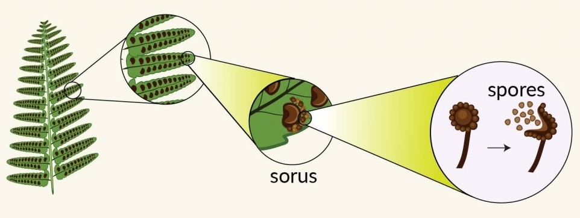
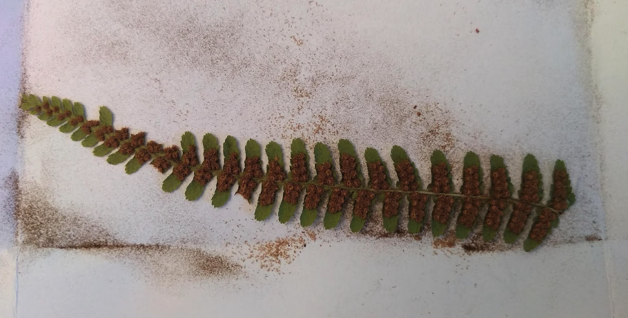
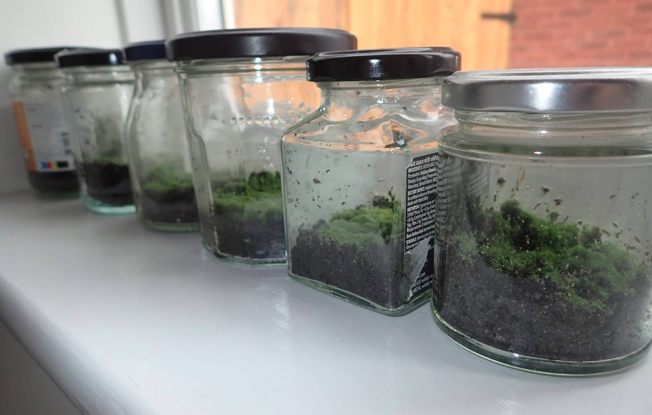
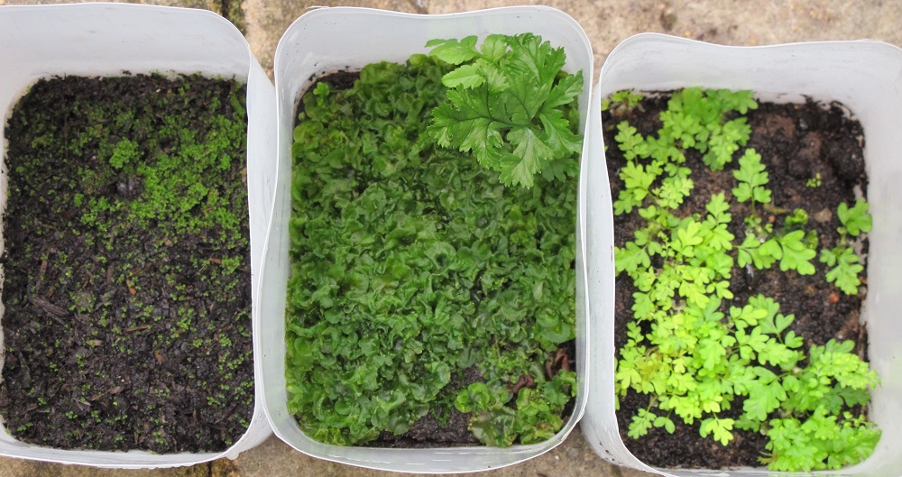

### Collecting spores
- Spores are ready at different times, usually toward the end of summer. Look for sori on the underside of the fronds. If you use a magnifying glass, you’ll see that fully ripe sporangia look like shiny, round balls or clusters. Choose a frond in which a few of the sporangia have burst open. The rest of the sporangia should be intact and shiny. Fern fronds not used immediately can be sealed in a plastic bag and kept in the refrigerator for up to a week.

- Cut a portion of the frond.
- Lay on paper in a dry place.

### Sowing spores

1. Prepare tray:
   - Bottom half: Sterilized Sphagnum moss
   - Top half: Alpine mix (low nutrient bark mix with grit and small amount of lime)

2. Sow spores:
   - Sprinkle spores on top of the mix
   - Label tray and cover with plastic or glass

3. Germination conditions:
   - Place tray in container with 5 cm water
   - Keep in shade
   - Maintain temperature at 20-25°C
   - Top up water occasionally

### Growing fern

4. Development stages:
   
   - 3 weeks: Green film appears (prothalli)
   - 6 weeks: Film resembles moss
   - 5-6 months: Tiny heart-shaped gametophytes develop
   - First fronds indicate successful fertilization

5. Acclimation:
   - When 2-3 young fronds develop, create small gap in cover
   - Gradually increase gap over few days
   - Remove cover completely after 2-3 weeks